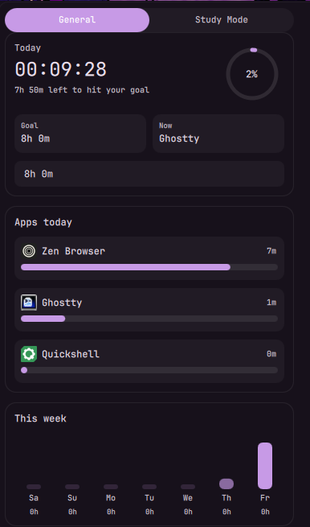
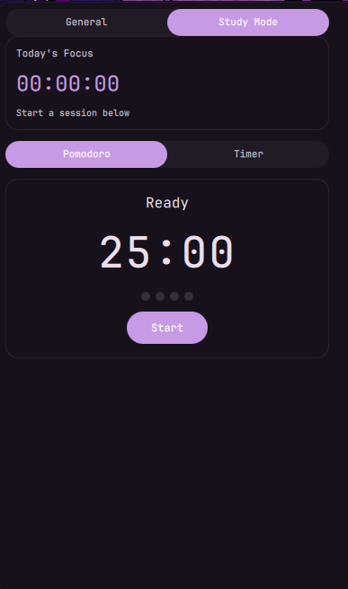

# Screen Time & Study Timer Tracker

Track time spent in applications on Dank Material Shell, with a built-in study mode featuring Pomodoro and a countdown timer.

## Screenshots

| General Mode | Study Mode |
|---|---|
|  |  |

## Features

### General Mode
- **Automatic tracking** — polls active window every 2 seconds via `hyprctl` / `niri msg`
- **Daily & weekly stats** — bar pill shows today's total; popout shows per-app breakdown and weekly heatmap
- **Daily goal** — configurable target with progress ring indicator
- **App ignore list** — exclude browsers, chat apps, etc. from tracking
- **Data persistence** — 30-day rolling history stored in plugin state
- **IPC commands** — `dms ipc call screenTimeTracker getStatus` / `resetToday`

### Study Mode
- **Pomodoro timer** — focus/break cycle (25m focus, 5m short break, 15m long break) with cycle tracking
- **Study timer** — simple countdown with presets (15m, 30m, 45m, 60m, 90m)
- **Focus time tracking** — accumulates time spent in study sessions
- **Slide animation** — smooth transition between General and Study Mode

## Installation

```bash
# Clone or copy to DMS plugins directory
cp -r screen-time-tracker ~/.config/DankMaterialShell/plugins/screenTimeTracker

# Restart DMS
dms restart
```

Then enable the plugin from **Settings → Plugins** and add the widget to your bar.

## Requirements

- DMS >= 1.5.0
- Hyprland or Niri (for window focus detection)

## Usage

- The bar pill shows today's total (or countdown during a study session)
- Click to open the popout, toggle between **General** and **Study Mode** at the top
- In Study Mode, switch between **Pomodoro** and **Timer** sub-modes
- Configure daily goal, ignored apps, and pomodoro durations in **Settings → Plugins → Screen Time Tracker**

## Data Storage

Data is stored in `~/.local/state/DankMaterialShell/plugins/screenTimeTracker_state.json`. Old entries (>30 days) are automatically pruned.
